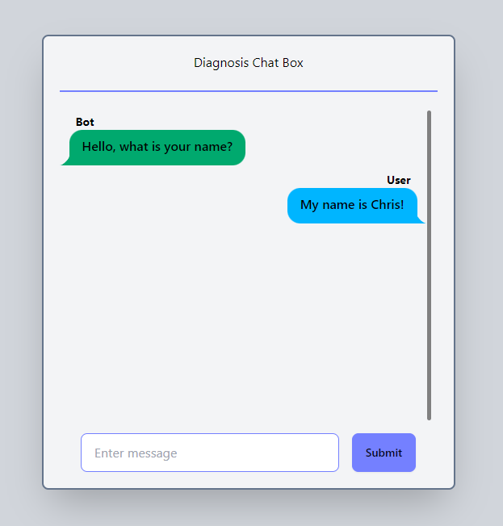

# Diabetes Diagnosis Chat Front End

This project is a personal alternative front-end application designed to facilitate real-time communication between patients and healthcare AI LLM model for diabetes diagnosis. By leveraging a chat interface, users can discuss symptoms, receive medical advice, and manage their health more effectively. The application aims to provide an accessible and user-friendly platform to support diabetes management and improve patient outcomes.

This was created as an alternative front end of the [AI Diabetes Chatbot](https://github.com/hopenjin/AI_Diabetes_Diagnosis_System) project. For this project to function it requires the backend and LLM in that project to work.
